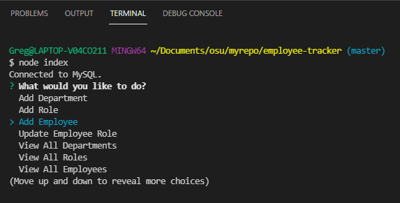

# Employee Tracker

## Overview
This assignment asked us to create a command-line employee management system that tracks a company's employee database using Node.js, Inquirer and MySQL. Within the application users can add departments, roles, employees and view the tables, displayed using the console.table package.

## Demonstration Video
[Demo Video](https://watch.screencastify.com/v/f5zJkA9CIv0D40iLR0su)

## Primary Technologies Used
* Node
* Express
* Inquirer
* console.table
* Javascript

## Preview

